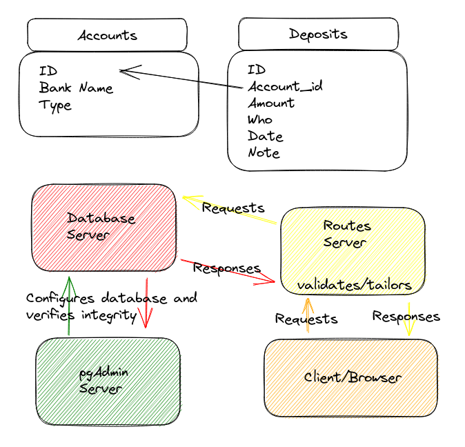

# DB_money-tracker
Full Stack setup for simple two-table database and the calls to it.

## ERD

## Files
  - .gitignore
    - ignores the node_modules folder when pushing to GitHub
  - docker-compose.yaml
    - configures docker and sets up three servers
      - postgreSQL server
      - pgAdmin server
      - api routes server
  - Dockerfile
    - configuration file for the api routes server
  - server.js
    - routes for access the database
  - index.html
    - front end file to load into the browser for web access
  - index.js
    - front end file to add functionality to index.html
  - *.json
    - list of libraries/configurations required
  - README.md
    - this file
